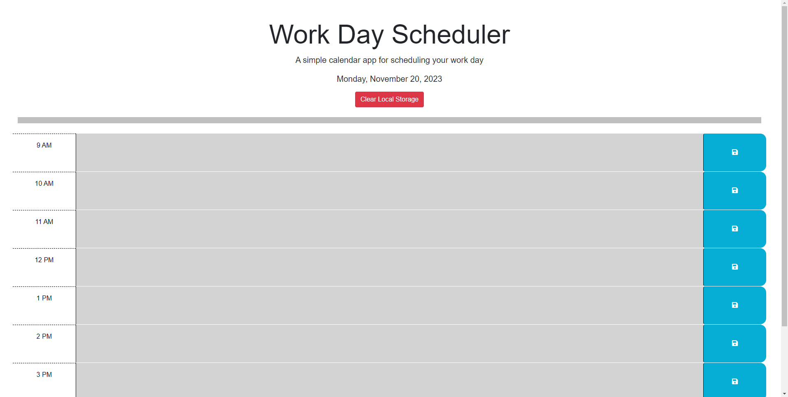
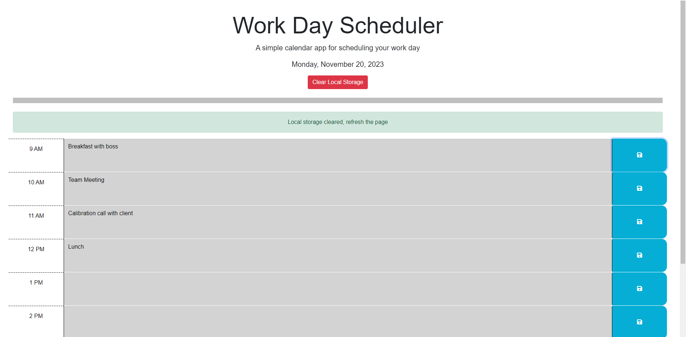

# Work Day Scheduler Starter Code
Here is a planner that anyone can use to schedule the different events they have during the day.  As your day goes by, your past is highlighted in gray, your current time period is in red, and green is for any future times.  

As you save events, a message is displayed confirming that it has been saved to local storage.  This way, even if you need to close the page, your times will still be displayed
