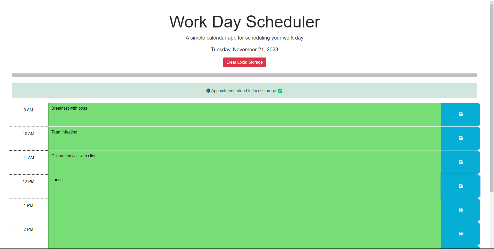
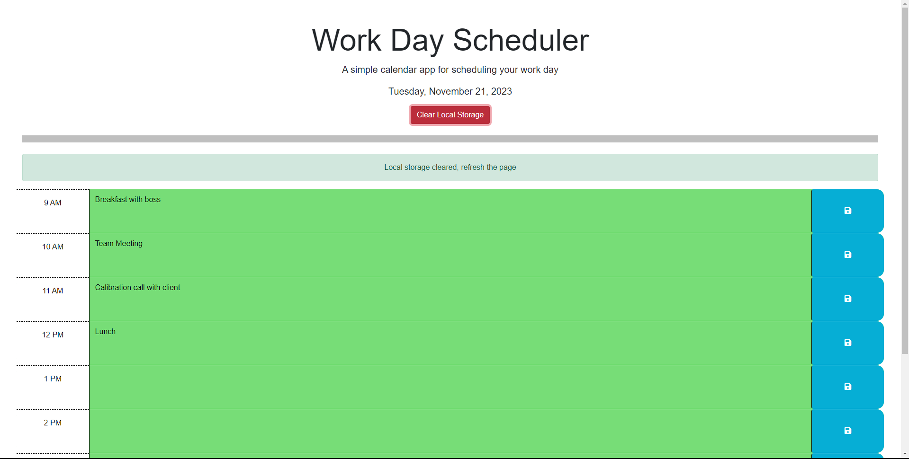
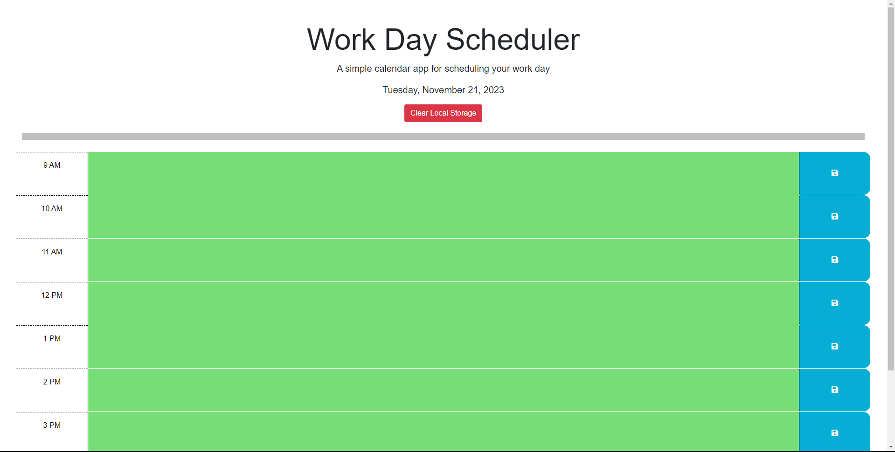

# Busy-guy Planer
Reference code source:  https://github.com/coding-boot-camp/crispy-octo-meme
Note:  The basic structure of all of the files originated from this code source.  The main elements in the html file and css file were dominantly coded by the source code.  You can view the origin source at the repository above or take a peek at my commit time-line to see the journey I made to develop this application.

Here is a planner that anyone can use to schedule the different events they have during the day.  As your day goes by, your past is highlighted in gray, your current time period is in red, and green is for any future times.  

As you save events, a message is displayed confirming that it has been saved to local storage.  This way, even if you need to close the page, your times will still be displayed

Lastly, there is a Clear Local Storage button that clears local storage which clears out your daily activities.

This way, you can use this planner everday!
